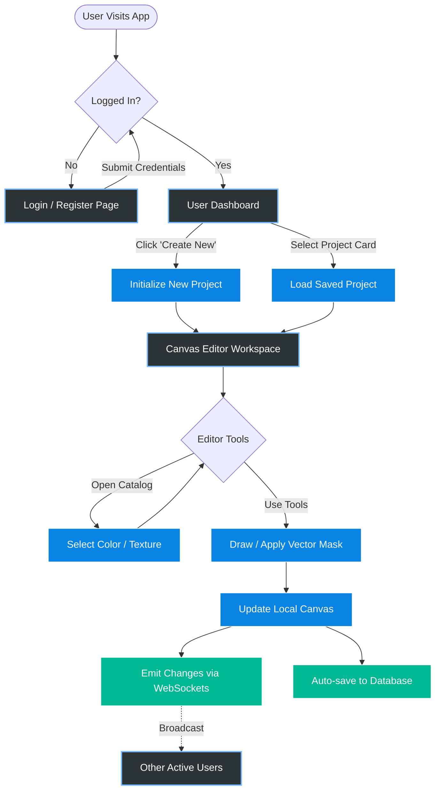

# Normal User UI Design Summary & Flow Diagram

## 1. UI Design Summary (Normal User)

The "Normal User" experience in the **Smart Wall Paint Visualizer** is designed to be intuitive, focusing on core room design and collaboration without the clutter of administrative tools.

*   **Authentication Views (Login/Register):**
    *   Clean, minimalist forms with modern typography (Outfit / Inter) and material symbols.
    *   Clear error messaging and seamless transitions between sign-up and sign-in.
*   **User Dashboard:**
    *   **Project Grid:** A visually appealing card grid displaying thumbnail previews of the user's saved room visualization projects.
    *   **Quick Actions:** A prominent "Create New Project" floating action button (FAB) or dedicated card.
*   **Canvas Editor (Core Workspace):**
    *   **Interactive Canvas:** A large, infinite-zooming workspace powered by Konva.js for applying paint and textures to room images.
    *   **Heads-Up Display (HUD):** Non-intrusive floating toolbars for:
        *   Freehand drawing tools and brush sizes.
        *   Vector polygon masking (to isolate walls).
        *   Layer stack adjustment (managing multiple paint layers).
    *   **Catalog Panel:** An easily accessible side drawer or bottom sheet for browsing trending paint colors (e.g., Sage Green, Terracotta) and seamless wall textures.
*   **Real-time Collaboration Indicators:**
    *   Subtle UI elements (like avatars or toast notifications) showing when another designer joins the same canvas room, with immediate visual feedback of their drawing actions.

---

## 2. User Interaction Flow Diagram

This flowchart illustrates the step-by-step journey of a standard user interacting with the application.

