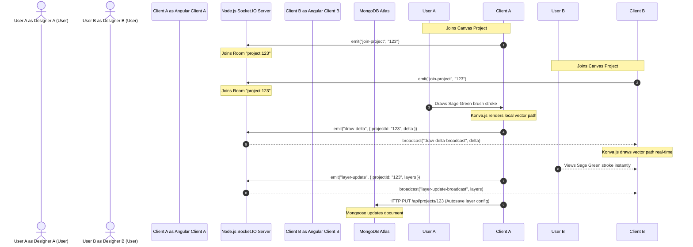

# SMART WALL PAINT VISUALIZER — PHASE 2 CODE ARCHITECTURE & WORKFLOWS

---

## 1. END-TO-END SYSTEM REQUEST FLOW

This flowchart visualizes the complete path of an application request from user interaction in the Angular client down to the database persistence layer in MongoDB Atlas, routing through the containerized Nginx reverse proxy.

```mermaid
flowchart TD
    subgraph Frontend Client (Angular 20)
        A[User Component: e.g., CanvasEditorComponent] -->|triggers action / selects color| B[Angular Signals Store / State]
        B -->|calls| C[Angular Service: e.g., ProjectService]
        C -->|HTTP Request / Bearer Token| D[Angular HttpClient]
    end

    subgraph Container Proxy
        D -->|port 80| E[Nginx Reverse Proxy]
        E -->|routes /api/* to port 5000| F[Express Server API Gateway]
    end

    subgraph Backend Server (Node.js/Express)
        F -->|1. helmet & cors| G[Security Middleware]
        G -->|2. rateLimit| H[Rate Limiter]
        H -->|3. authMiddleware| I[JWT Validator]
        I -->|4. requireRole| J[RBAC Guard]
        J -->|5. match Route| K[Express Routes: e.g., projectRoutes]
        K -->|invokes method| L[Express Controller: e.g., ProjectController]
        L -->|executes business rules| M[Service Layer: e.g., ProjectService]
        M -->|interacts via| N[Repository Layer: e.g., ProjectRepository]
        N -->|performs CRUD| O[Mongoose Models: e.g., Project Schema]
    end

    subgraph Data & Cloud Services
        O -->|persistent storage| P[(MongoDB Atlas Cluster)]
        M -->|image binary streaming| Q[Cloudinary API]
    end
```

---

## 2. REAL-TIME SOCKET COLLABORATION WORKFLOW

This sequence diagram displays how two remote designers collaborate on the same room visualizer canvas simultaneously using Socket.IO.



---

## 3. COMPLETE FILE DIRECTORY MANIFEST

Below is the list of all files built during Phase 2, with direct references to their location in the workspace:

### 3.1 Backend Server (`express-server/`)
* **Entry Point**:
  * [index.ts](file:///c:/Users/Rishi/OneDrive/Pictures/project/express-server/src/index.ts) - Bootstraps http server, loads routers, rate limiters, security guards, and Socket.IO connection binds.
* **Database & Cloud Config**:
  * [db.ts](file:///c:/Users/Rishi/OneDrive/Pictures/project/express-server/src/config/db.ts) - Mongoose Atlas database connector.
  * [cloudinary.ts](file:///c:/Users/Rishi/OneDrive/Pictures/project/express-server/src/config/cloudinary.ts) - Cloudinary API instance settings.
  * [seed.ts](file:///c:/Users/Rishi/OneDrive/Pictures/project/express-server/src/config/seed.ts) - Pre-populates the database with trending colors (Sage Green, Terracotta) and wall textures.
* **Mongoose Schema Models**:
  * [User.ts](file:///c:/Users/Rishi/OneDrive/Pictures/project/express-server/src/models/User.ts) - User profile schema with credential details.
  * [Project.ts](file:///c:/Users/Rishi/OneDrive/Pictures/project/express-server/src/models/Project.ts) - Stores room layout layers, canvas zooming coordinates, and ownership keys.
  * [Color.ts](file:///c:/Users/Rishi/OneDrive/Pictures/project/express-server/src/models/Color.ts) - Color catalog swatches schema.
  * [Texture.ts](file:///c:/Users/Rishi/OneDrive/Pictures/project/express-server/src/models/Texture.ts) - Seamless texture mapping schema.
  * [AuditLog.ts](file:///c:/Users/Rishi/OneDrive/Pictures/project/express-server/src/models/AuditLog.ts) - Tracks security actions, registrations, and design adjustments.
* **Repositories (Data Access Isolation)**:
  * [UserRepository.ts](file:///c:/Users/Rishi/OneDrive/Pictures/project/express-server/src/repositories/UserRepository.ts)
  * [ProjectRepository.ts](file:///c:/Users/Rishi/OneDrive/Pictures/project/express-server/src/repositories/ProjectRepository.ts)
  * [ColorRepository.ts](file:///c:/Users/Rishi/OneDrive/Pictures/project/express-server/src/repositories/ColorRepository.ts)
  * [TextureRepository.ts](file:///c:/Users/Rishi/OneDrive/Pictures/project/express-server/src/repositories/TextureRepository.ts)
  * [AuditLogRepository.ts](file:///c:/Users/Rishi/OneDrive/Pictures/project/express-server/src/repositories/AuditLogRepository.ts)
* **Business Services**:
  * [AuthService.ts](file:///c:/Users/Rishi/OneDrive/Pictures/project/express-server/src/services/AuthService.ts) - Registration, login, password hashes, and JWT signature processing.
  * [ProjectService.ts](file:///c:/Users/Rishi/OneDrive/Pictures/project/express-server/src/services/ProjectService.ts) - CRUD logic with Cloudinary file integration and mock-up fallbacks.
  * [CatalogService.ts](file:///c:/Users/Rishi/OneDrive/Pictures/project/express-server/src/services/CatalogService.ts) - Exposes paint colors, brands, and textures.
  * [AdminService.ts](file:///c:/Users/Rishi/OneDrive/Pictures/project/express-server/src/services/AdminService.ts) - Adjusts user permissions, gets audit logs, and calculates dashboard statistics.
* **Routing Controllers**:
  * [AuthController.ts](file:///c:/Users/Rishi/OneDrive/Pictures/project/express-server/src/controllers/AuthController.ts)
  * [ProjectController.ts](file:///c:/Users/Rishi/OneDrive/Pictures/project/express-server/src/controllers/ProjectController.ts)
  * [CatalogController.ts](file:///c:/Users/Rishi/OneDrive/Pictures/project/express-server/src/controllers/CatalogController.ts)
  * [AdminController.ts](file:///c:/Users/Rishi/OneDrive/Pictures/project/express-server/src/controllers/AdminController.ts)
* **Express Routes Aggregators**:
  * [index.ts](file:///c:/Users/Rishi/OneDrive/Pictures/project/express-server/src/routes/index.ts) - Root API path binding.
  * [authRoutes.ts](file:///c:/Users/Rishi/OneDrive/Pictures/project/express-server/src/routes/authRoutes.ts)
  * [projectRoutes.ts](file:///c:/Users/Rishi/OneDrive/Pictures/project/express-server/src/routes/projectRoutes.ts)
  * [catalogRoutes.ts](file:///c:/Users/Rishi/OneDrive/Pictures/project/express-server/src/routes/catalogRoutes.ts)
  * [adminRoutes.ts](file:///c:/Users/Rishi/OneDrive/Pictures/project/express-server/src/routes/adminRoutes.ts)
* **Middlewares**:
  * [authMiddleware.ts](file:///c:/Users/Rishi/OneDrive/Pictures/project/express-server/src/middleware/authMiddleware.ts) - JWT session checking.
  * [rbacMiddleware.ts](file:///c:/Users/Rishi/OneDrive/Pictures/project/express-server/src/middleware/rbacMiddleware.ts) - Allowed role checks.
  * [multerMiddleware.ts](file:///c:/Users/Rishi/OneDrive/Pictures/project/express-server/src/middleware/multerMiddleware.ts) - Multer disk storage setup using OS temp folder.
  * [errorMiddleware.ts](file:///c:/Users/Rishi/OneDrive/Pictures/project/express-server/src/middleware/errorMiddleware.ts) - Catch-all error mapping.
* **WebSocket Integration**:
  * [socketHandler.ts](file:///c:/Users/Rishi/OneDrive/Pictures/project/express-server/src/sockets/socketHandler.ts) - Direct WebSocket channel mapping.

### 3.2 Frontend Client (`angular-client/`)
* **Configurations & Bootstrapping**:
  * [app.config.ts](file:///c:/Users/Rishi/OneDrive/Pictures/project/angular-client/src/app/app.config.ts) - Configures providers including `provideHttpClient` and `provideRouter`.
  * [app.routes.ts](file:///c:/Users/Rishi/OneDrive/Pictures/project/angular-client/src/app/app.routes.ts) - Dynamic page paths with lazy loaded feature routes.
  * [index.html](file:///c:/Users/Rishi/OneDrive/Pictures/project/angular-client/src/index.html) - Standard HTML frame loading Outfit / Inter fonts and material symbols.
  * [app.html](file:///c:/Users/Rishi/OneDrive/Pictures/project/angular-client/src/app/app.html) - Houses router-outlet view port.
* **Services**:
  * [auth.service.ts](file:///c:/Users/Rishi/OneDrive/Pictures/project/angular-client/src/app/services/auth.service.ts) - Handles login state using Signals.
  * [project.service.ts](file:///c:/Users/Rishi/OneDrive/Pictures/project/angular-client/src/app/services/project.service.ts) - Accesses project database endpoints.
  * [catalog.service.ts](file:///c:/Users/Rishi/OneDrive/Pictures/project/angular-client/src/app/services/catalog.service.ts) - Fetches colors & textures.
  * [socket.service.ts](file:///c:/Users/Rishi/OneDrive/Pictures/project/angular-client/src/app/services/socket.service.ts) - Emits and receives drawing updates.
  * [admin.service.ts](file:///c:/Users/Rishi/OneDrive/Pictures/project/angular-client/src/app/services/admin.service.ts) - Performs user management.
* **Navigation Guards**:
  * [auth.guard.ts](file:///c:/Users/Rishi/OneDrive/Pictures/project/angular-client/src/app/guards/auth.guard.ts) - Restricts project views.
  * [admin.guard.ts](file:///c:/Users/Rishi/OneDrive/Pictures/project/angular-client/src/app/guards/admin.guard.ts) - Restricts admin configurations page.
* **Feature Views Components**:
  * [login.component.ts](file:///c:/Users/Rishi/OneDrive/Pictures/project/angular-client/src/app/features/auth/login.component.ts) ([HTML](file:///c:/Users/Rishi/OneDrive/Pictures/project/angular-client/src/app/features/auth/login.component.html) | [SCSS](file:///c:/Users/Rishi/OneDrive/Pictures/project/angular-client/src/app/features/auth/login.component.scss)) - Login view.
  * [register.component.ts](file:///c:/Users/Rishi/OneDrive/Pictures/project/angular-client/src/app/features/auth/register.component.ts) ([HTML](file:///c:/Users/Rishi/OneDrive/Pictures/project/angular-client/src/app/features/auth/register.component.html) | [SCSS](file:///c:/Users/Rishi/OneDrive/Pictures/project/angular-client/src/app/features/auth/register.component.scss)) - Sign up view.
  * [dashboard.component.ts](file:///c:/Users/Rishi/OneDrive/Pictures/project/angular-client/src/app/features/dashboard/dashboard.component.ts) ([HTML](file:///c:/Users/Rishi/OneDrive/Pictures/project/angular-client/src/app/features/dashboard/dashboard.component.html) | [SCSS](file:///c:/Users/Rishi/OneDrive/Pictures/project/angular-client/src/app/features/dashboard/dashboard.component.scss)) - Project listing card grid and creation.
  * [admin.component.ts](file:///c:/Users/Rishi/OneDrive/Pictures/project/angular-client/src/app/features/admin/admin.component.ts) ([HTML](file:///c:/Users/Rishi/OneDrive/Pictures/project/angular-client/src/app/features/admin/admin.component.html) | [SCSS](file:///c:/Users/Rishi/OneDrive/Pictures/project/angular-client/src/app/features/admin/admin.component.scss)) - User roles toggles, auditing list, analytics cards, CMS catalog addition.
  * [canvas-editor.component.ts](file:///c:/Users/Rishi/OneDrive/Pictures/project/angular-client/src/app/features/canvas-editor/canvas-editor.component.ts) ([HTML](file:///c:/Users/Rishi/OneDrive/Pictures/project/angular-client/src/app/features/canvas-editor/canvas-editor.component.html) | [SCSS](file:///c:/Users/Rishi/OneDrive/Pictures/project/angular-client/src/app/features/canvas-editor/canvas-editor.component.scss)) - Infinite zooming, freehand drawing, vector polygon masking, layer stack adjustment HUD.

---

## 4. DOCKER & DEPLOYMENT SPECS

To run the full stack environment locally, the system uses docker-compose to orchestrate the backend server and frontend client Nginx image:

* **Compose File**:
  * [docker-compose.yml](file:///c:/Users/Rishi/OneDrive/Pictures/project/docker-compose.yml) - Maps API server to port `5000` and client proxy portal to port `80`.
* **API Container Config**:
  * [Dockerfile](file:///c:/Users/Rishi/OneDrive/Pictures/project/express-server/Dockerfile) - Multi-stage Node image building TypeScript and trimming build dependencies.
* **Client Container Config**:
  * [Dockerfile](file:///c:/Users/Rishi/OneDrive/Pictures/project/angular-client/Dockerfile) - Builds Angular browser packages and copies to Nginx html directory.
  * [nginx.conf](file:///c:/Users/Rishi/OneDrive/Pictures/project/angular-client/nginx.conf) - Configures Nginx proxying of `/api/*` and `/socket.io/*` down to the Node server.
