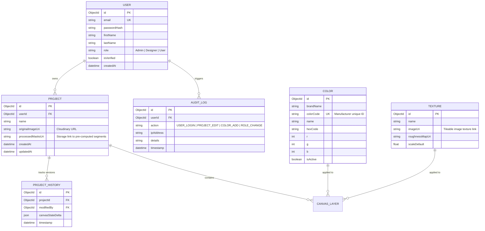

# SMART WALL PAINT VISUALIZER — ENTERPRISE SYSTEM SPECIFICATION (PHASE 1)

---

## 1. PRODUCT DESIGN & PRD ANALYSIS

### 1.1 PRD Analysis
The **Smart Wall Paint Visualizer** is an enterprise-grade web application designed to allow users to upload photos of their rooms and virtually paint the walls. It bridges the gap between home improvement visualization and paint retail by offering real-time, highly accurate interactive tools coupled with an administrative backend for managing colors, textures, and user roles.

Key success metrics for the visualizer include:
- **Visual Accuracy**: Flawless edge detection and color blending (realistic light/shadow overlays on colored walls).
- **Usability**: Intuitive canvas tools (Bucket, Brush, Polygon, Eraser) accessible on both desktop and mobile devices.
- **Enterprise Features**: Real-time project collaboration, comprehensive auditing, customizable user permissions, and admin dashboard analytics.

### 1.2 Business Goals
- **Increase Sales Conversion**: Help customers visualize colors before purchase, reducing buyer hesitation.
- **Reduce Product Returns**: Avoid customer dissatisfaction due to incorrect color selection by simulating realistic lighting and textures.
- **Drive User Engagement**: Provide a modern, interactive design playground where users can save and share projects.
- **Scale B2B Partnerships**: Allow interior designers and paint retailers to use the visualizer for client consultations.

### 1.3 User Stories
- **As a Homeowner (Guest/Registered)**:
  - I want to upload an image of my room so that I can visualize different paint combinations on my walls.
  - I want to select a wall and fill it with a specific color instantly using a bucket fill tool.
  - I want to manually paint fine details or erase overlays to clean up edges.
  - I want to save my designs as projects and compare multiple color options side-by-side.
  - I want to export my design as high-quality files (PNG/PDF) or share it with my contractor.
- **As an Interior Designer (Pro User)**:
  - I want to work with layers to organize different wall sections and objects in a project.
  - I want to apply realistic textures (matte, gloss, stucco, brick) to walls.
  - I want to view exact paint color code matching (RGB, HEX, Pantone, Paint Brand IDs).
- **As a System Administrator (Admin)**:
  - I want to manage the paint color catalog and texture libraries.
  - I want to manage user accounts, assign roles (Admin, Designer, User), and monitor user activity.
  - I want to view analytics on popular colors, user activity, and system resource utilization.

### 1.4 Functional & Non-Functional Requirements

#### Functional Requirements
1. **User Authentication & Profiles**: Secure signup, login, password recovery, and email verification. Role-Based Access Control (RBAC).
2. **Project Management**: CRUD operations for projects, autosave, history log, and version control.
3. **Canvas Editor**: Interactive photo manipulation with bucket fill, polygon drawing, brush/eraser adjustments, zoom/pan, and undo/redo stacks.
4. **Color & Texture Library**: Searchable database of cataloged paint colors and textures, categorizable by collections/brands.
5. **Real-time Sync**: Collaborative editing on projects using WebSockets (Socket.IO).
6. **Admin Control Panel**: Comprehensive CMS for colors, textures, user management, audit logs, and analytics charts.

#### Non-Functional Requirements
1. **Performance**: Initial page load under 2 seconds; canvas paint rendering/updating latency under 100ms.
2. **Scalability**: Support for up to 10,000 concurrent sessions; microservices-ready structure with containerization.
3. **Security**: OWASP Top 10 mitigation; encrypted payloads (JWT, HTTPS); sanitization of image uploads; rate limiting.
4. **Reliability**: 99.9% uptime target; database replication (MongoDB Atlas); automated backup strategy.
5. **Accessibility (a11y)**: Compliance with WCAG 2.1 AA standards; keyboard navigable canvas tools; screen reader friendly.
6. **Responsiveness**: Mobile-first fluid design adapting seamlessly from 320px (mobile) to 4K resolutions.

### 1.5 MVP vs. Future Roadmap
| Feature Area | MVP (Phase 1/2/3) | Future Roadmap (V2+) |
| :--- | :--- | :--- |
| **Canvas Tools** | Bucket, Brush, Polygon, Eraser, Zoom/Pan, Undo/Redo | AI-powered automatic wall detection (CV), 3D depth-mapping |
| **Color Library** | Admin-curated color catalog, RGB/HEX search | Integration with external paint manufacturer APIs (Sherwin-Williams, Behr) |
| **Collaboration** | Local project sharing, static link generation | Live cursor real-time collaborative editing sessions |
| **Platform support**| Desktop/Mobile Web application | Native iOS and Android Visualizer Apps (with AR capabilities) |

---

## 2. UX & INFORMATION ARCHITECTURE

### 2.1 User Journeys
- **Homeowner Journey**:
  1. Lands on home page $\rightarrow$ Explores visualizer sandbox.
  2. Prompted to Sign Up $\rightarrow$ Creates account $\rightarrow$ Verifies email.
  3. Enters Dashboard $\rightarrow$ Clicks "New Project".
  4. Uploads room photo $\rightarrow$ Image pipeline processes and displays image.
  5. Selects wall $\rightarrow$ Applies "Soft Sage Green" with Matte texture.
  6. Compares design with "Warm Beige" version in split view.
  7. Saves project $\rightarrow$ Exports PDF containing paint brand specs.

- **Admin Journey**:
  1. Logs in via secure admin portal.
  2. Views Admin Dashboard showing registration curves and popular colors.
  3. Navigates to User Management $\rightarrow$ Updates user roles.
  4. Navigates to Paint Catalog $\rightarrow$ Uploads new color swatch set (CSV + Images).
  5. Navigates to Audit Logs to inspect system modifications.

### 2.2 Sitemap & Navigation Flow
```
[Landing Page]
   │
   ├── [Login / Register / Forgot Password]
   │
   └── [User Dashboard]
         ├── [Profile Settings]
         ├── [Projects List]
         │     └── [Project Details]
         │           └── [Canvas Editor Workspace]
         │                 ├── [Color Swatch Drawer]
         │                 ├── [Texture Selector]
         │                 ├── [History / Layers Panel]
         │                 └── [Export / Share Dialog]
         └── [Notifications Center]

[Admin Dashboard] (Restricted)
   ├── [User Management]
   ├── [Role & Permission Admin]
   ├── [Catalog CMS (Colors & Textures)]
   └── [System Logs & Analytics]
```

### 2.3 System Tokens & Styling Foundations
To maintain an enterprise-level aesthetic, a unified Design Token System is defined:

#### Color Palette (Tailored HSL)
- **Primary / Accent**: `hsl(215, 80%, 50%)` (Deep Cobalt Blue)
- **Secondary**: `hsl(160, 60%, 45%)` (Teal)
- **Dark Mode Background**: `hsl(222, 47%, 11%)` (Deep Obsidian Blue)
- **Light Mode Background**: `hsl(210, 40%, 98%)` (Clean Slate White)
- **Surface (Card/Dialog)**: `hsl(223, 47%, 15%)` / `hsl(0, 0%, 100%)`
- **Border / Divider**: `hsl(217, 32%, 18%)` / `hsl(214, 32%, 91%)`
- **Success**: `hsl(142, 70%, 45%)` | **Warning**: `hsl(48, 96%, 53%)` | **Error**: `hsl(0, 84%, 60%)`

#### Typography (Google Font: Outfit & Inter)
- **Headings**: `font-family: 'Outfit', sans-serif;` (Clean geometric shapes)
- **Body / Code**: `font-family: 'Inter', monospace;` (High legibility)
- **Scale**:
  - `h1`: `2.25rem` (36px), line-height: 1.2
  - `h2`: `1.75rem` (28px), line-height: 1.3
  - `h3`: `1.25rem` (20px), line-height: 1.4
  - `body-lg`: `1rem` (16px) | `body-sm`: `0.875rem` (14px)

#### Layout, Shadows, & Borders
- **Border Radius**: Small (`4px`), Medium (`8px`), Large (`16px`), Pill (`999px`)
- **Shadows**:
  - Soft Elevate: `0 4px 6px -1px rgba(0, 0, 0, 0.1), 0 2px 4px -1px rgba(0, 0, 0, 0.06)`
  - Glassmorphic Outline: `border: 1px solid rgba(255, 255, 255, 0.08); backdrop-filter: blur(12px);`

---

## 3. SYSTEM ARCHITECTURE & CODE LAYOUT

### 3.1 Folder Structure (Clean Architecture - Feature First)
The codebase uses a mono-repository structure separating the frontend (Angular) and the backend (Node.js/Express) with high modularity:

```
/
├── angular-client/             # Angular 20 Frontend
│   ├── src/
│   │   ├── app/
│   │   │   ├── @core/          # Global services, guards, interceptors, error handling
│   │   │   │   ├── guards/
│   │   │   │   ├── interceptors/
│   │   │   │   └── services/
│   │   │   ├── @shared/        # Reusable components, pipes, directives, design system UI
│   │   │   ├── @layout/        # Header, Footer, Sidebar, Layout wrappers
│   │   │   ├── @features/      # Lazy loaded feature modules
│   │   │   │   ├── auth/
│   │   │   │   ├── dashboard/
│   │   │   │   ├── projects/
│   │   │   │   ├── admin/
│   │   │   │   └── canvas-editor/
│   │   │   ├── @store/         # NgRx Signals store for global state management
│   │   │   └── @config/        # Environment configurations, routing trees
│   │   │   └── app.config.ts
│   │   └── assets/             # Brand logos, fallback textures, SVGs
│   ├── tsconfig.json           # Declares path import aliases (@core/*, @shared/*, etc.)
│   └── package.json
│
├── express-server/             # Node.js/Express Backend
│   ├── src/
│   │   ├── config/             # DB connections, Cloudinary setup, constants
│   │   ├── middleware/         # Auth verification, RBAC guard, file upload, error logger
│   │   ├── models/             # Mongoose schemas (User, Project, Color, Texture, AuditLog)
│   │   ├── repositories/       # Data Access abstraction layer
│   │   ├── services/           # Business logic implementation
│   │   ├── controllers/        # HTTP controllers parsing request parameters
│   │   ├── routes/             # Express routing mapping paths to controllers
│   │   ├── sockets/            # WebSockets handling project collaboration sync
│   │   └── index.ts            # Entry point
│   ├── package.json
│   └── Dockerfile
│
└── docker-compose.yml          # Local container configuration
```

### 3.2 Import Alias Strategy
To maintain clean imports and prevent deeply-nested relative paths (`../../../../`), the following TypeScript aliases are configured:
- `@core/*` $\rightarrow$ `src/app/@core/*`
- `@shared/*` $\rightarrow$ `src/app/@shared/*`
- `@features/*` $\rightarrow$ `src/app/@features/*`
- `@canvas/*` $\rightarrow$ `src/app/@features/canvas-editor/*`
- `@store/*` $\rightarrow$ `src/app/@store/*`
- `@config/*` $\rightarrow$ `src/app/@config/*`

---

## 4. DATABASE & BACKEND DESIGN

### 4.1 Database ERD Specification
Below is the structural relationship of the MongoDB Collections. Mongoose validation is enforced.



### 4.2 Restful API Specification

#### Authentication (`/api/auth`)
- `POST /register` - Registers new user, sends email verification token.
- `POST /login` - Verifies credentials, returns JWT in Secure HTTPOnly Cookie + User metadata payload.
- `POST /logout` - Invalidates server session token cookie.
- `POST /verify-email` - Verifies account with verification token.
- `POST /forgot-password` / `POST /reset-password` - Handles self-service recovery.

#### Projects (`/api/projects`)
- `GET /` - List all projects owned by user (supports search, sort, pagination).
- `POST /` - Create a project (requires room image upload $\rightarrow$ routes through Cloudinary pipeline).
- `GET /:id` - Retrieve project data, canvas configuration, and layers.
- `PUT /:id` - Save current project status.
- `DELETE /:id` - Soft-delete project.

#### Paint & Textures (`/api/catalog`)
- `GET /colors` - Fetch color catalogs (filterable by brand, color family, search).
- `GET /textures` - Fetch texture library.
- `POST /colors` (Admin) - Create new paint catalog item.
- `POST /textures` (Admin) - Upload seamless tile texture asset.

#### Administration (`/api/admin`)
- `GET /users` - Manage user roles and details.
- `GET /audit-logs` - Inspect system logs.
- `GET /analytics/popular-colors` - Fetch analytical data for reporting.

### 4.3 Security & Caching Strategy
- **Encryption**: Data in transit via SSL/TLS. Passwords hashed using bcrypt (12 rounds).
- **JWT Protection**: Tokens signed using RS256 private/public key pairs with 15-minute lifespan; refreshed via sliding-window Refresh Token stored securely.
- **Rate Limiting**: Exponentional backoff on `/auth` endpoints; strict API rate-limiting via Express Rate Limit (100 requests per 15 minutes per IP).
- **Caching Layer**: Redis cache layer on `/api/catalog/colors` and `/api/catalog/textures` to prevent heavy DB hits on static resources.

---

## 5. DEPLOYMENT & PERFORMANCE INFRASTRUCTURE

### 5.1 Docker Architecture
A multi-container setup isolates components securely:
- **web-client**: Serves built Angular distribution using Nginx.
- **api-server**: Runs Node.js environment cluster mode.
- **nginx-proxy**: Edge proxy routing external traffic (`/` to web-client, `/api` & `/socket.io` to api-server) with security header injection.

### 5.2 Performance Optimization Checklist
- [x] **Lazy Loading**: Route-based chunk splitting on Angular frontend to guarantee minimal initial payload.
- [x] **Image Pre-processing**: Cloudinary transformation parameters dynamically resize uploaded room photos matching screen resolution.
- [x] **State Minimization**: Save canvas project histories as binary JSON deltas rather than duplicate full high-res frames.
- [x] **Asset Compression**: Brotli compression enabled at Nginx proxy layer for static JS/CSS bundles.
